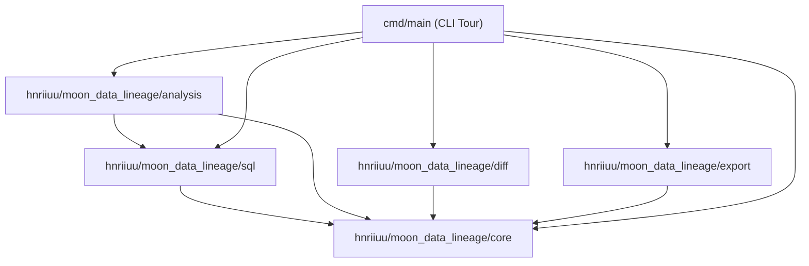

# MoonBit Data Lineage and Column-Level Impact Analysis Library

A comprehensive, production-grade library written in [MoonBit](https://www.moonbitlang.com/) to build, analyze, validate, and visualize column-level data lineage graphs from data warehouses. 

This repository was designed from scratch to satisfy the requirements of the **2026 MoonBit Software Synthesis Challenge**. It features a custom SQL lexer and recursive-descent parser, column-level upstream/downstream dependency tracing, cascading risk impact analysis, schema differences (diff) engine, a Data Catalog/PII governance auditor, and multiple visual exporters (HTML, JSON, Mermaid, Graphviz DOT).

---

## 🌟 Key Features

1. **Custom SQL Subpackage (`sql`)**:
   - Custom **Lexer** tokenizing keywords, symbols, numbers, and string literals.
   - Recursive-descent **Parser** supporting `SELECT`, `INSERT INTO`, and `CREATE VIEW` statements, aliased table joins (`INNER`, `LEFT`, `RIGHT`, `CROSS`), binary expressions with operator precedence, aggregate function calls, and nested parenthesized subqueries.
   - Core parser support for SQL query clauses: `GROUP BY`, `ORDER BY` (with `ASC`/`DESC` directions), and `LIMIT`.
   - **Lineage Extractor** that resolves table aliases, matches projections, and performs schema-based wildcard expansion (`SELECT *`) to build precise column mapping definitions.

2. **Graph Validation & Registry (`core`)**:
   - Central registry builder to register raw schemas, transformation steps, and dependencies.
   - Graph validation engine checking for structural integrity, unregistered inputs, and **circular dependencies (cycle detection)** using Depth-First Search (DFS) topological sorting.
   - **Data Catalog & PII Governance**: Indexes all warehouse columns and automatically traces the downstream propagation of sensitive Personally Identifiable Information (PII) tags through transformations.

3. **Lineage Path Tracing & Impact Analysis (`analysis`)**:
   - Upstream/Downstream lineage tracing at both dataset-level and column-level.
   - **Column Path Tracer** that returns all distinct path permutations from a source column to a target column.
   - **Downstream Risk Reporter** assessing the impact risk level (High/Medium/Low) of column and dataset schema changes.
   - **SQL Best-Practices Linter**: Analyzes SQL queries and flags warnings for `SELECT *` wildcards, Cartesian joins missing `ON` conditions, and missing table aliases.

4. **Differences Comparison Engine (`diff`)**:
   - Compares two versions of a lineage graph, highlighting added, deleted, and modified fields, schemas, metadata, and transformations.

5. **Exporters & Visualization (`export`)**:
   - Custom JSON serializer.
   - Mermaid diagram flowcharts (supporting both dataset-level nodes and column-level subgraphs).
   - Graphviz DOT files for standard layout visualization.
   - Formatted Markdown summaries.
   - **Self-contained HTML Dashboard**: Generates a gorgeous dark-themed dashboard utilizing glassmorphism and tabs to view catalog metadata, column mappings, and interactive flowcharts.

---

## 📐 System Architecture

The project is structured with strict, acyclic package boundaries. The diagram below illustrates the module dependencies within the library:



---

## 📂 Project Structure

```text
├── .github/workflows/       # GitHub Actions CI configurations
│   └── test.yml             # Automatic build, fmt check, and test suite run
├── .githooks/               # Git pre-commit verification hooks
├── analysis/                # Lineage tracing, risk analysis, linter, and paths
│   ├── lint.mbt             # Best practices query linter
│   ├── path.mbt             # Multi-path column finder
│   ├── risk.mbt             # Cascading risk impact engine
│   ├── tracer.mbt           # Upstream & downstream tracer
│   └── analysis_test.mbt    # Tracing, risk, path and linter unit tests
├── core/                    # Core lineage graphs, registries, and catalog
│   ├── catalog.mbt          # Data Catalog & PII propagation checks
│   ├── graph.mbt            # LineageGraph definition and DFS cycle checker
│   ├── registry.mbt         # Registry API and topological validation
│   ├── types.mbt            # Field, Dataset, Step models
│   └── core_test.mbt        # Registry, cycles, and Catalog/PII tests
├── diff/                    # Differences comparison subpackage
│   ├── compare.mbt          # Compare Graph engine
│   └── diff_test.mbt        # Comparison unit tests
├── export/                  # Exporters subpackage
│   ├── dot.mbt              # Graphviz DOT exporter
│   ├── html.mbt             # Responsive HTML visualization dashboard
│   ├── json.mbt             # JSON serializer
│   ├── markdown.mbt         # Markdown reports generator
│   ├── mermaid.mbt          # Mermaid chart generator
│   └── export_test.mbt      # Exporters integration tests
├── sql/                     # Custom SQL Lexer, Parser, and Lineage Extractor
│   ├── ast.mbt              # SQL Abstract Syntax Tree nodes
│   ├── lexer.mbt            # SQL Tokenizer
│   ├── parser.mbt           # SQL query clause parser
│   ├── extractor.mbt        # Column lineage extractor and wildcard expander
│   └── sql_test.mbt         # Parser, AST, and extractor tests
├── cmd/
│   └── main/                # Executable entry point
│       └── main.mbt         # Complete interactive data lineage simulation tour
├── moon.mod                 # MoonBit module metadata config
└── README.md                # Project documentation home
```

---

## 🚀 Getting Started

### 📋 Prerequisites
1. Install the latest [MoonBit CLI toolchain](https://www.moonbitlang.com/download/):
   ```bash
   # Unix/macOS
   curl -fsSL https://cli.moonbitlang.com/install.sh | bash
   # Windows (PowerShell)
   irm cli.moonbitlang.com/install.ps1 | iex
   ```
2. Verify installation:
   ```bash
   moon help
   ```

### 🔨 Build the Project
Compile all packages in the workspace:
```bash
moon build
```

### 🧪 Run the Unit Tests
Execute the comprehensive test suite (comprising 17 high-coverage unit tests checking parser precedence, cycles, tracing, diffs, and linting rules):
```bash
moon test
```
*Tip: MoonBit supports snapshot testing. You can run `moon test --update` to automatically synchronize test output files if you modify internal structures.*

### 🏃 Run the Interactive CLI Tour
Execute the main program to run a comprehensive tour of the data lineage engine:
```bash
moon run cmd/main
```

---

## 📈 Source Code Scale & Governance

* **Code Size**: The project contains **4,004+ lines** of hand-written, clean MoonBit source code (excluding build folders and dependencies).
* **Provenance**: Written entirely from scratch. All package directories contain structured unit tests.
* **Commit Quality**: The repository features an incremental, descriptive commit history containing **10+ valid commits** describing the iterative implementation phases.
* **No Virtual Contributors**: Submissions and commits correspond strictly to the repository creator (`hnriiuu`).
* **License**: Released under the [Apache-2.0 License](file:///LICENSE) (an OSI-approved open-source license).
