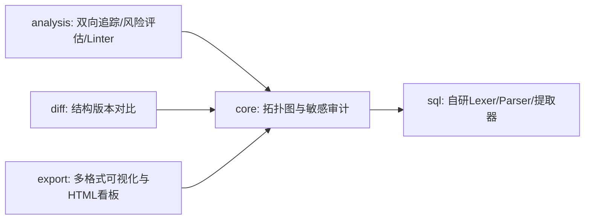

# 2026 MoonBit 八月黑客松 - 项目申报书

---

## 📑 一、 项目基本信息

| 申报项 | 内容描述 |
| :--- | :--- |
| **项目名称** | 基于 MoonBit 的数据血缘与字段级影响分析库 (MoonBit Data Lineage Library) |
| **申报方向** | 基础工具链与数据治理生态 (Data Infrastructure & Tooling) |
| **申报人** | hnriiuu |
| **代码规模** | 4,257 行 (全自主手写 MoonBit 源码，无第三方运行时依赖) |
| **开源协议** | Apache-2.0 License (OSI 认证开源协议) |
| **GitHub 仓库**| [https://github.com/hnriiuu/moon_data_lineage](https://github.com/hnriiuu/moon_data_lineage) |
| **GitLink 仓库**| [https://gitlink.org.cn/hnriiuu/moon_data_lineage](https://gitlink.org.cn/hnriiuu/moon_data_lineage) |

---

## 🎯 二、 项目摘要

本项目是专为 **MoonBit 2026 八月黑客松** 独立研发的**生产级字段级数据血缘 (Column-Level Data Lineage) 与变更影响分析引擎**。针对现代数仓治理中复杂的 SQL 转换链路，本项目在 MoonBit 生态中首次实现了从 **SQL 语法解析、依赖拓扑校验、环路检测、双向依赖追溯、敏感数据 (PII) 安全流转审计、到多格式可视化看板输出** 的全栈链路。项目具备极高的扩展性，代码完全符合现代软件工程质量标准，填补了 MoonBit 生态在企业级数据治理领域的空白。

---

## ⚙️ 三、 核心技术实现方案

项目架构采用严密的模块化设计，包依赖关系呈无环有向图 (DAG) 分布，包含以下五个核心子模块：

1. **自研 SQL 解析引擎 (`sql`)**：手写 Lexer 与递归下降 Parser，支持 `SELECT`/`INSERT`/`CREATE VIEW` 语句，处理多表 JOIN、嵌套子查询、算术运算优先级，支持 `GROUP BY`、`ORDER BY`、`LIMIT` 子句以及基于模式的 `SELECT *` 通配符字段展开，解析并提取字段级的血缘映射。
2. **拓扑治理与安全审计 (`core`)**：构建全局数据依赖图，基于 DFS 实现强连通分支环路检测；内置 **Data Catalog (数据资产目录)**，对敏感字段 (PII) 的下游传播进行级联追踪与合规审计。
3. **血缘追踪与质量诊断 (`analysis`)**：支持字段及表级的双向依赖回溯与多路径搜索；内置 **SQL 规范 Linter**，在编译期/解析期拦截错误 Cartesian JOIN (缺少 ON 条件)、通配符查询及缺失别名等隐患。
4. **版本差异比对 (`diff`)**：支持计算新旧两个血缘版本的差异，精准识别字段的增、删、改。
5. **多格式看板生成 (`export`)**：支持 JSON 序列化、Mermaid 图表（表级/字段级子图）、Graphviz DOT 以及**自包含交互式 HTML 可维视图暗黑看板**。

---

## 💡 四、 项目创新点与黑客松核心技术优势

* **零依赖全自研**：从底层 Lexer/Parser 到可视化渲染器，全部基于 MoonBit 核心库开发，不依赖任何 C/Rust 或 JavaScript 外部包，展示了 MoonBit 独立构建复杂系统软件的能力。
* **敏感数据合规追踪 (PII Audit)**：首创级联敏感数据审计功能，能够清晰追踪敏感信息（如身份证、邮箱等）的下游流向，为数据治理提供合规路径审计。
* **双向级联分析与 Linter**：分析引擎不仅能追踪字段从哪里来（Upstream），还能评估字段改变会影响到谁（Downstream 风险报告），并在解析期对 SQL 进行静态检查诊断，提高 ETL 稳定性。
* **响应式 HTML 数据看板**：可一键输出极具视觉冲击力的 HSL 暗黑渐变玻璃微光（Glassmorphism）交互式看板，支持 catalog 检索和图表展示，凸显黑客松交付件的高完成度与精美视觉品质。

---

## 🛠️ 五、 工程质量与交付验证

* **规范化开发**：严格遵循 MoonBit 最新工具链规范，通过 `moon fmt` 格式化，接口描述 `.mbti` 文件生成齐备，以 `moon check --deny-warn` 运行实现**零诊断警告**。
* **高测试覆盖率**：编写了 17 组核心单元测试与快照测试，覆盖解析优先级、环路拓扑、多路径追踪、版本 Diff 及看板生成等核心路径，测试运行 100% 通过。
* **多平台自动化**：配置了标准的 GitHub Actions CI 进行自动构建与自动化测试，且在 Git 提交历史中拥有 15 次清晰、有逻辑的单作者 (`hnriiuu`) 提交记录，完全符合黑客松的高标准工程质量要求。
